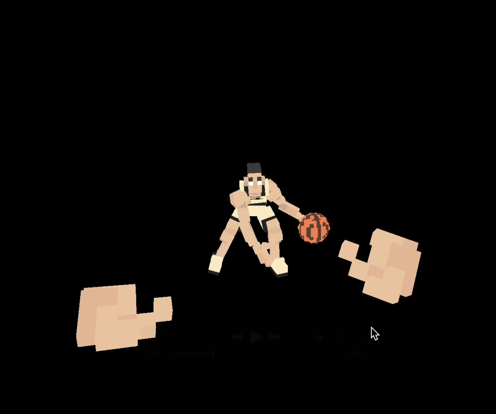

# 🏀 Hands-Off-My-Ball

_This lil' baller keeps dodging your hand 👋_

### How it’s made

- Built voxel characters in **MagicaVoxel**, exported as `.obj`
- Imported to **Blender** for animation (13-frame hover cycle)

  

- Exported position & quaternion rotation for each frame
- Reconstructed characters in **Pyglet** using custom `body_objects.json`
- Assembled parts via cubes in `CustomGroup` (BodyPart, Ball, Hand)

  

- Played animations with quaternions
- Used `AnimationManager` to switch states on mouse hover

---

_Every quaternion here tells a story._ 🥹

---

`#blender` `#pyglet` `#animation` `#voxel` `#quaternion` `#interactive`
